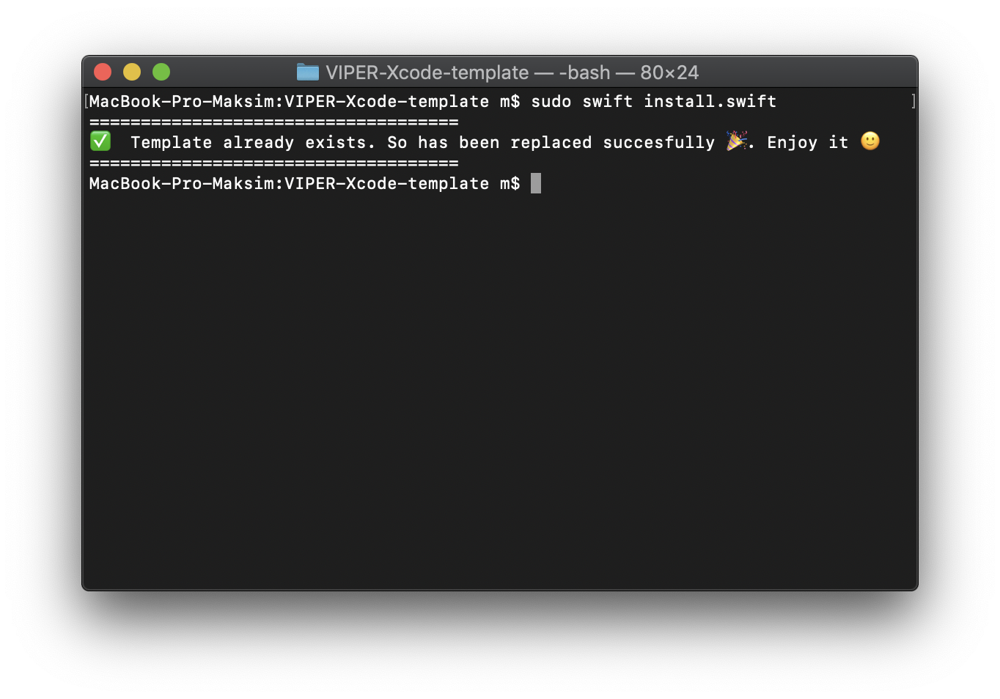

When you decide to use VIPER architecture in your project, it is very tired create new modules, because you need create at least 6 files for each. Imagine that you need to create 6 modules...This template solves the problem and creates all files at once:
* Protocols
* Configurator
* ViewController
* Interactor
* Presenter
* Router

## How to install

Just clone the git, open terminal, navigate to project's folder and run the following command:
```swift
sudo swift install.swift
```
After the installation is completed, you should see this:



## Easy to use
Just create new file, select template and type in the module's name:


## Generated code
This template generates all files that you need to create a new VIPER module. All generated code is written in Swift 4.


## VIPER diagram overview


## Why VIPER?
After using VIPER, I've found it to be very beneficial in many ways. Let’s get back to the list of things we set out to accomplish when architecting our app to see if VIPER addresses them.

- Easy to iterate on
- Collaboration friendly
- Separated out concerns
- Spec-ability

## References
- 🇺🇸 [iOS Architecture Patterns](https://medium.com/ios-os-x-development/ios-architecture-patterns-ecba4c38de52#.ba7q8dcih)
- 🇺🇸 [#8 VIPER to be or not to be?](https://swifting.io/blog/2016/03/07/8-viper-to-be-or-not-to-be/)
- 🇷🇺 [Введение в VIPER](https://habr.com/post/273061/)


## Authors

* [Maxim Skryabin](http://mskr.name)
* [Juanpe Catalán - original creator](https://github.com/Juanpe/Swift-VIPER-Module)
